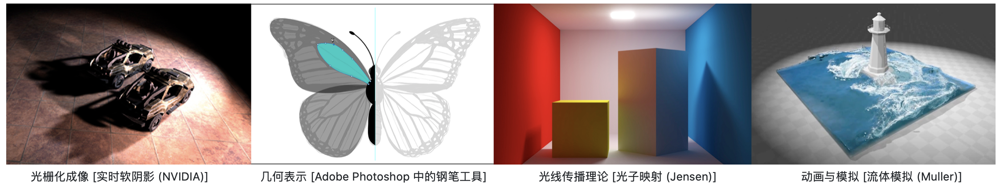
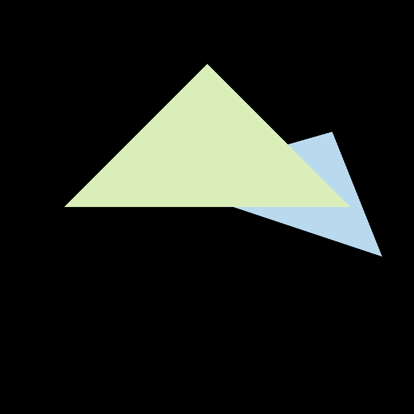
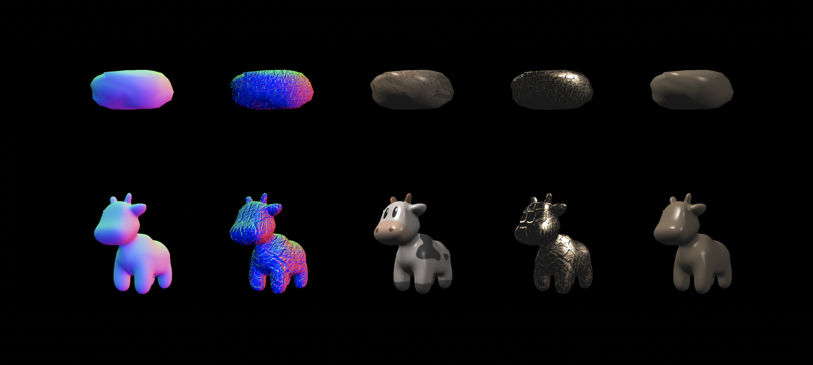
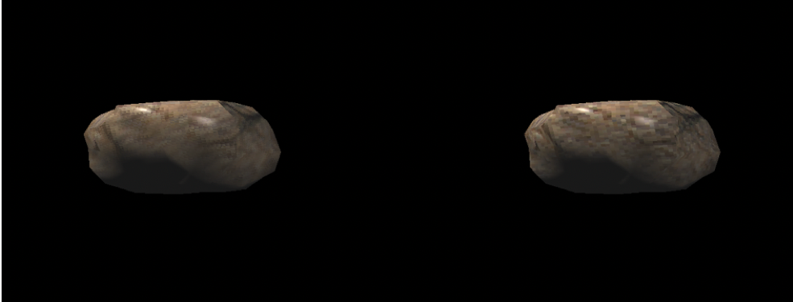
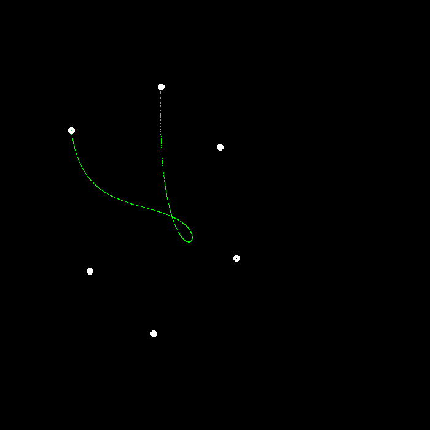
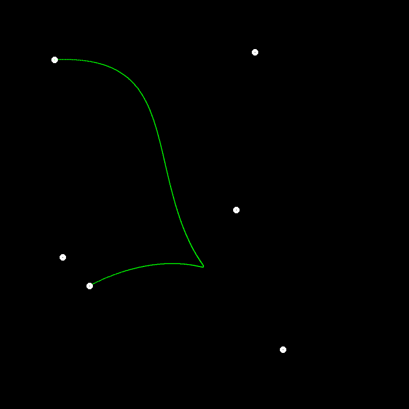

# GAMES101: Introduction to Computer Graphics

* This is the online course taught by [Ling-Qi Yan](https://sites.cs.ucsb.edu/~lingqi/index.html) in Chinese.
* There are **eight assignments** and **one final project**. All eight assignments only need Eigen, OpenCV except assignment 8.
* My overall grade is **114.81 / 115**. 
* Course Homepage can be found [here](https://sites.cs.ucsb.edu/~lingqi/teaching/games101.html).

## Assignment 1: Rotation and Projection
### Requirements
* Build the model matrix and the perspective projection matrix correctly
* Press the key to rotate the triangle or use the command line to get the rotated image
* [Bonus] Build the model matrix to rotate the triangle around any axis through the origin
### Results (grade: 35 / 35)

## Assignment 2: Triangles and Z-buffering
### Requirements
* Implement triangle rasterization algorithm
* Implement z-buffer algorithm and  draw triangles on the screen in order
* [Bonus] Implement super-sampling algorithm (anti-aliasing)
### Results (grade: 50 / 50)
* Raw result

* Result with MSAA

## Assignment 3: Pipeline and Shading
### Requirements
* Interpolate colors, normal vectors, texture coordinates, and position correctly
* Implement Blinn-phong reflection model correctly
* Implement Texture Mapping correctly
* Implement Bump mapping and Displacement mapping correctly
* [Bonus] Try more models: Find other available .obj files and render them
* [Bonus] Implement bilinear texture interpolation
### Results (grade: 58 / 58)
* The results from left to right are normal mapping, bump mapping, texture mapping, displacement mapping and Blinn-phong reflection model. 

* Results w/o bilinear texture interpolation

## Assignment 4: Bézier Curve
### Requirements
* Implement De Casteljau Algorithm
* [Bonus] Implement anti-aliasing of Bézier curve
### Results (grade: 40 / 40)
* Raw result

* Result with anti-aliasing

## Assignment 5: Intersection of Light and Triangle
### Requirements
* Implement the light generation part
* Implement the Moller-Trumbore algorithm
### Results (grade: 30 / 30)

## Assignment 6: Sturcture of Acceleration
### Requirements
* Bounding Box Intersection: Correctly implement the intersection function of light and bounding box
* Implement BVH to accelerate the intersection of light and scene
* [Bonus] SAH search: learn SAH (Surface Area Heuristic) and implement SAH acceleration
### Results (grade: 60 / 60)
* Comparison
    * Time for creating BVH: 220 ms, time for rendering: 3274 ms
    * Time for creating SAH-BVH: 532 ms, time for rendering: 2921 ms
* Result of BVH

* Result of SAH

